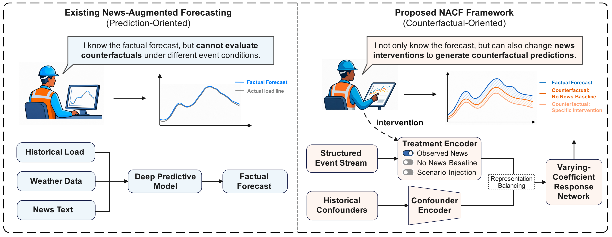
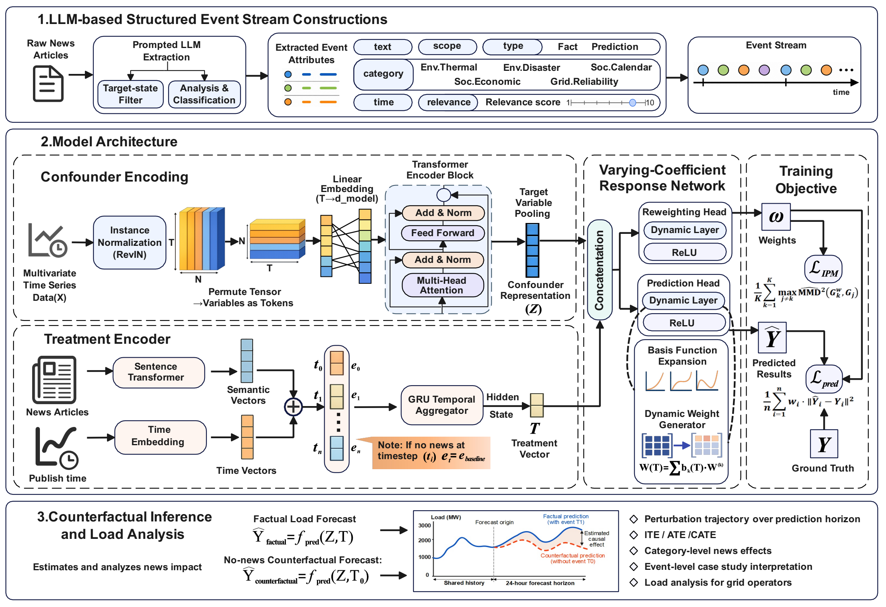

# Counterfactual Load Forecasting with LLM-Structured Events and Representation Learning

This repository contains the project website, source code, released dataset, and public inference checkpoint for the paper:

**Counterfactual load forecasting with LLM-structured events and representation learning**  
Yujie Chen, Yifei Gao, Runyao Yu, Yuhe Wu, Guangyu Wang, Yue Chen, Tongxin Li  
*Applied Energy*, 425, 128554, 2026  
DOI: [10.1016/j.apenergy.2026.128554](https://doi.org/10.1016/j.apenergy.2026.128554)

NACF formulates news-aware load analysis as a counterfactual forecasting problem. It compares the factual load trajectory under observed news events with alternative trajectories under modified news treatments, such as removing observed events or injecting hypothetical event scenarios. The framework converts unstructured news into structured event streams, encodes these events as continuous semantic treatments, and estimates treatment-dependent load trajectories with representation balancing.

Project website: <https://yujiechen8888.github.io/counterfactual-load-forecasting-web/>

## Method Overview





## Repository Structure

```text
.
├── src/                         # Next.js project website
├── public/                      # Website figures and demo data
└── nacf/                        # Reproducible NACF code release
    ├── data/
    │   └── nsw_2019_structured_events.csv
    ├── weights/
    │   └── nacf_nsw_2019_public.pth
    ├── notebooks/
    │   └── counterfactual_inference_tutorial.ipynb
    ├── run.py
    ├── train.py
    ├── model.py
    ├── dataset.py
    ├── losses.py
    ├── utils.py
    ├── config.py
    └── requirements.txt
```

The released checkpoint contains NACF-trained parameters only. The sentence encoder `sentence-transformers/all-MiniLM-L6-v2` is loaded through `sentence-transformers` at runtime.

## Run NACF

Create a Python environment and install the NACF dependencies:

```bash
cd nacf
pip install -r requirements.txt
```

Run the default training entry point:

```bash
python run.py
```

By default, this command trains on:

```text
data/nsw_2019_structured_events.csv
```

Training outputs are written to `nacf/results/` and are ignored by git.

## Run The Notebook

```bash
cd nacf
jupyter notebook notebooks/counterfactual_inference_tutorial.ipynb
```

Run all cells to reproduce a single-window counterfactual inference example with observed news, no-news baseline, and a custom injected event.
The notebook uses the released public checkpoint at `weights/nacf_nsw_2019_public.pth`.

## Acknowledgements and Code References

We thank the authors and maintainers of the following open-source repositories, which provided helpful references for this work:

- [From_News_to_Forecast](https://github.com/daydreamer-amelia/From_News_to_Forecast)
- [CausalMob](https://github.com/YangXiaojie1998/CausalMob)
- [Time-Series-Library](https://github.com/thuml/Time-Series-Library)

## Citation

```bibtex
@article{CHEN2026128554,
title = {Counterfactual load forecasting with LLM-structured events and representation learning},
journal = {Applied Energy},
volume = {425},
pages = {128554},
year = {2026},
issn = {0306-2619},
doi = {https://doi.org/10.1016/j.apenergy.2026.128554},
url = {https://www.sciencedirect.com/science/article/pii/S0306261926012109},
author = {Yujie Chen and Yifei Gao and Runyao Yu and Yuhe Wu and Guangyu Wang and Yue Chen and Tongxin Li},
keywords = {Counterfactual forecasting, Load analysis, Representation learning},
abstract = {News-reported social, environmental, and grid events can substantially reshape electricity demand, yet quantifying how such events perturb forecasted load trajectories remains largely unaddressed. Existing news-augmented forecasting studies use news as auxiliary features to reduce prediction error but cannot answer counterfactual questions about demand under alternative event conditions. Counterfactual forecasting naturally formulates this problem by comparing the factual trajectory under observed news with counterfactual trajectories under alternative treatments, such as removing events or injecting hypothetical scenarios. However, counterfactual outcomes are inherently unobservable, so the prediction error cannot be directly minimized from data. This challenge is compounded by confounding: news occurrence is entangled with weather, calendar, and historical load conditions that independently affect demand. Guided by a generalization bound for continuous treatments that decomposes the unobservable counterfactual error into weighted factual loss and representation balance, this paper proposes the News-Aware Counterfactual Load Analysis Framework (NACF) to control this error upper bound through observable training objectives. NACF converts unstructured news into structured event streams via an offline large language model, encodes these as continuous semantic treatments with a no-news baseline, and estimates treatment-dependent load trajectories through a varying-coefficient response network with learned sample reweighting and Integral Probability Metric (IPM)-based representation balance regularization. Experiments on an Australian electricity-demand dataset show that NACF remains competitive in factual forecasting while providing evidence of treatment-intensity structure, improved representation balance, and interpretable demand perturbations in synthetic interventions and real event case studies.}
}
```
